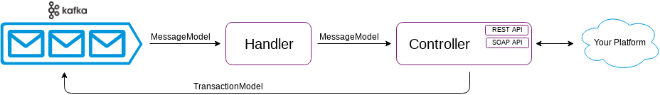

# Connector Base from [Zenvia](https://www.zenvia.com/)

This is a basic example of the [Zenvia](https://www.zenvia.com/) connector.

With this connector base, you can create your connector for integration with your platform with [Zenvia](https://www.zenvia.com/).

The development team will evaluate your connector and they will deploy in the [Zenvia](https://www.zenvia.com/) environment.

[](LICENSE)
[](https://travis-ci.org/zenvia/node-connector-base)
[](https://coveralls.io/github/zenvia/node-connector-base?branch=master)


## Prerequisites

* [Node](https://nodejs.org/)
* [Git](https://git-scm.com/)
* [Apache Kafka](https://kafka.apache.org/) (***optional***)
* [Docker](https://www.docker.com/) (***optional***)


## Quick Start

**1.** Clone the repository.

```shell
git clone https://github.com/zenvia/node-connector-base.git
```

**2.** Install the dependencies.

```shell
npm run setup
```

**3.** Connector integration with your platform.

You will implement it in the `send` method of the file `src/controllers/sms-sender-message-controller.ts`. In this example, the [Zenvia](https://www.zenvia.com/) SMS send [API](https://zenviasmsenus.docs.apiary.io/#reference/api-services/sending-a-single-sms) was implemented.

The flow in the connector is below.




**4.** Integration of your platform with the connector.

You will implement it in the `receive` method of the file `src/controllers/sms-receiver-webhook-controller.ts`. In this example, the [Zenvia](https://www.zenvia.com/) SMS receive [API](https://zenviasmsenus.docs.apiary.io/#reference/api-callbacks) was implemented.

The flow in the connector is below.


## Tests

### Automatic tests

**1.** Run the tests.

```shell
npm run test
```


### Manual tests

**1.** Build the project.

```shell
npm run build
```

**2.** Run the project.

```shell
npm run start:dev
```

**3.** Starting Kafka.

```shell
docker run --name kafka --publish 9092:9092 --env ADVERTISED_HOST=localhost --env ADVERTISED_PORT=9092 --env TOPICS=KAFKA_PRODUCER_TOPIC_HIGH_PRIORITY,KAFKA_PRODUCER_TOPIC_LOW_PRIORITY,KAFKA_CONSUMER_TOPICS spotify/kafka
```

**4.** Publishing a message to Kafka.

```shell
echo '{"messageId":"MESSAGE_ID","channel":{"type":"CHANNEL_TYPE","provider":"CHANNEL_PROVIDER"},"from":"INTEGRATION_ID","to":["FROM"],"content":[{"type":"text/plain","payload":{"text":"Test message."}}],"credentials":{"authorization":"dXNlcjpwYXNzd29yZA==","integrationId":"967e5cad-1bd4-40c6-989f-74c71e98c282"}}' | docker exec -i kafka bash -c "/opt/kafka_2.11-0.10.1.0/bin/kafka-console-producer.sh --broker-list localhost:9092 --topic CONSUMER_TOPIC"
```

**5.** Requesting for Webhook.

```shell
curl --verbose "http://localhost:3000/v1/webhook" \
--request POST \
--header "Content-Type: application/json" \
--header "Some-Header: SOME_HEADER" \
--data-binary "{
    \"callbackMoRequest\": {
        \"id\": \"20690090\",
        \"mobile\": \"555191951711\",
        \"shortCode\": \"40001\",
        \"account\": \"zenvia.envio\",
        \"body\": \"Some message\",
        \"received\": \"2019-05-27T14:27:08.488-03:00\",
        \"correlatedMessageSmsId\": \"hs765939061\"
    }
}"
```


## Useful Docker commands

* **Remove a container**:

```shell
docker rm kafka
```


## License

[MIT](LICENSE)
